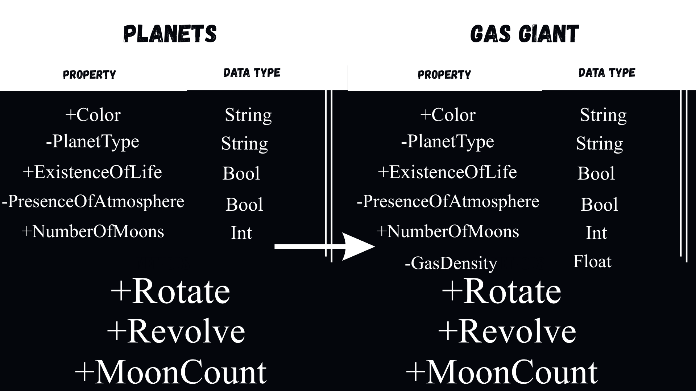
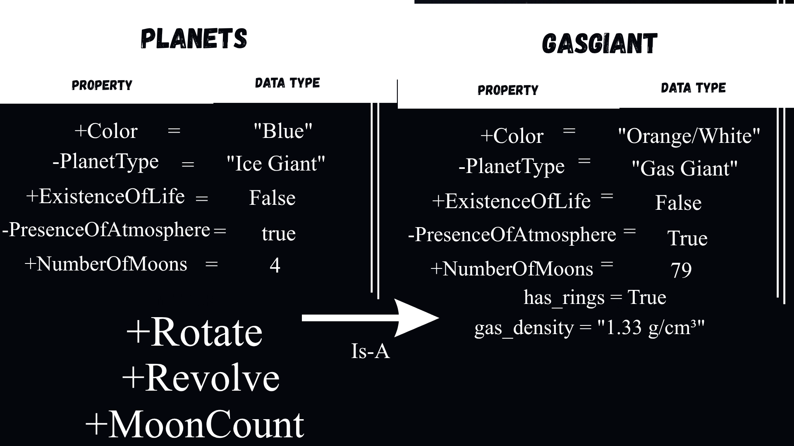

# Advanced Class Relationships
## Previous Activities
[classAttrib](classAttributesMethods.md)
[classRel](classRelationships.md)
## Existing System Description:
## Inheritance Relationship
Parent:Planets
Child:GasGiant
Explanation:
## Inheritance UML

## Composition/Aggregation
Relationship:Composition
Explanation:system has a strong ownership over its internal StarCore. The core is initialized directly inside the solar setup and collapses automatically upon system destruction.

## Advanced UML Diagram

## Python Implementation
[Source Code](advancedRelationships.py)
## Test Run

## Object Diagram

## Reflection
Answers:
1. I made GasGiant class as a child of the Planets parent class. It fits perfectly into an "IS-A" relationship structure while introducing properties specific to gaseous compositions.
2. Inheritance completely avoided redeclaring basic variables like color, existenceOfLife, and NumberOfMoons. The child class setup delegates core data structures directly back to the parent instead of executing duplicated assignment operations.
3. The link connecting system to StarCore represents Composition because a solar system's core energy generator cannot exist without the structural container of the system itself. 
4. The simple peer association used in Part III simply linked autonomous classes together via list tracking, letting them exist detached from each other. The advanced mechanisms implemented here create clear systemic hierarchies. Inheritance forces a strict shared behavior model between general and specific objects, while Composition links object lifecycles directly to their owners.
5. The design follows the DRY principle because it extracts general astronomical attributes from the main Planets model. 
