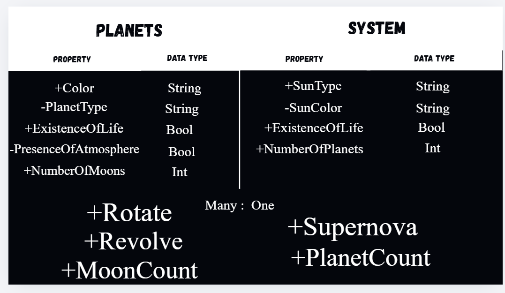
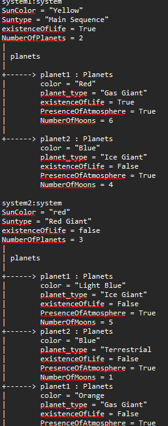

## Previous Work
[Part I - Classes and Objects](classObjectUML.md)
[Part II - Class Attributes and Methods](classAttributesMethods.md)
## Existing Class
Class:Planets
Description:A class that show the characteristics of a planet
## New Related Class
Class:System
Description:a class that shows the system wherein the planets live in
## Association
Relationship: System > planet
Explanation: Planets are a part of planets
## Multiplicity

Multiplicity: Many to one
Explanation: Systems have many planets 
## UML Class Relationship Diagram

## Python Implementation
[View Python Source](classRelationships.py)
## Test Run

## Object Relationship Diagram

## Analysis
### What is the association between your two classes?
The system is where the planets resides. In it's center, a star is present which locks orbit on a several planets.
### What multiplicity did you choose and why?
A multiplicity of many to one is perfect because a system directly contain planets. Systems contains a star which planets revolve around and that is why we can link systems to planets.
### How did you implement the relationship in Python?
I connected it with the existence of life in the system. If the system's star goes supernova, the 'ExistenceOfLife' in every planet would toggle to false, if it weren't already.
### Why did you store an object reference instead of copying its data?
Storing the objects data makes it more in-sync with the other classes. It makes the distinct classes consistent in their relationship with one another.
### If your relationship uses many, why is a list appropriate?
A list is needed because it preserves the order of the system.